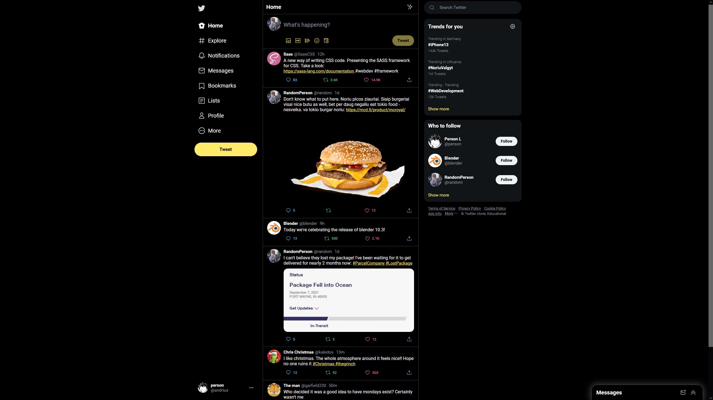

# Twitter clone site
A website that I recreated in order to practice my CSS skills. Inspired by [this guide from Monsterlessons Academy](https://youtu.be/aQNypoBaUNk)



### [Live Site](https://golden-pegasus-b2aeb6.netlify.app/)
## Lessons learned
- Creating unusual page layouts with grid
- Further improving flexbox knowledge
- Was made aware of the CSS BEM naming method when it came to naming classes/ids

While developing the website I challenged myself to make the page responsive on various screen sizes using media queries. When it came to working on the media queries I was met with a problem that I had unknowingly created for myself - the various media query styles were overlapping as I was overusing the `@media (max-width:)` values. 

As an example, the CSS that was present on `@media max-width: 1200px` would also get shown on `@media max-width: 1000px`. I fixed this by using media queries for the exact scopes of screen sizes with the help of `@media (max-width: 1200px) and (min-width: 1000px)`.

## Added additional features
- Changed the whole appearance of the page to a dark theme
- Added media queries for different sized screens all the way from mobile to large screens
- Added hover effects on all of the elements that had them on the original Twitter website
- Made sure to fix the hover effect on the sidebar menu so that the effect itself would take up as much width as the content itself takes up 
- Added the page status layout ( The "Home" status seen on the top-middle )
- Added the user's little screen on the bottom left of the left sidebar
- Added interaction buttons for each of the tweets
- Added the search bar on the top right side
- Added the settings gear icon on the right side inside the "Trends For you" heading
- Added a "Show more" button at the end of each window of the elements on the right side
- Added a policy block on the right side after the "Trends for you" and "Who to follow" blocks
- Finally created the floating "Messages" block


## Replicating all of the files on your local machine
As the files of the website contain CSS and HTML which run without any additional dependencies, you can simply clone the git repo.
```
# Navigate to any folder on your local machine and run
git clone https://github.com/mriusdev/twittr-replica.git
```
